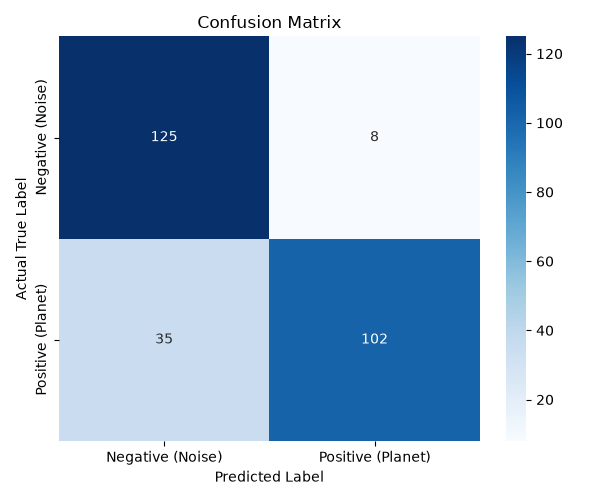
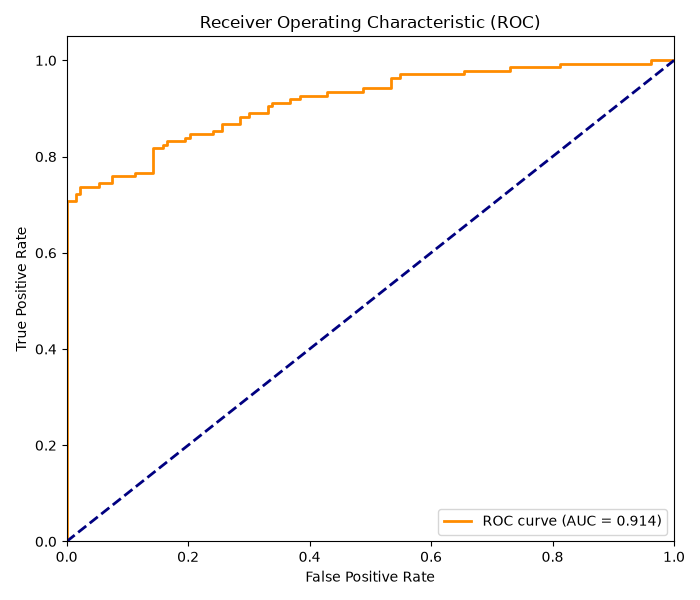
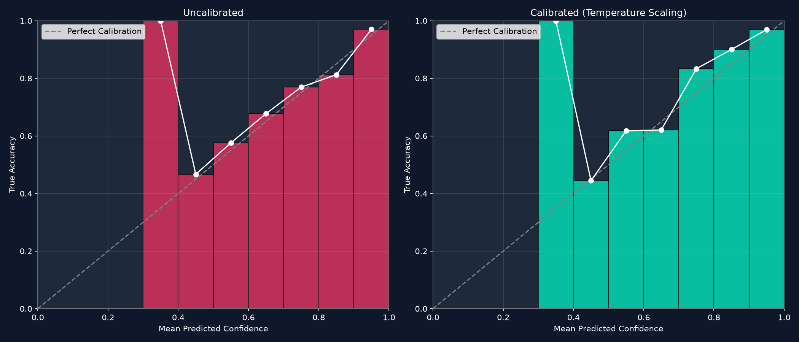

# Exoplanet Detection: From Kaggle Failure to NASA API Success

-brightgreen.svg)


This project documents a two-part investigation into exoplanet detection using Deep Learning. 
Part 1 documents an exhaustive investigation and eventual failure caused by a corrupted Kaggle dataset.
Part 2 documents the breakthrough success of abandoning the static dataset, building a custom pipeline that fetches live data from the NASA MAST archive, and training a 90% accurate Convolutional Neural Network (CNN) protected by heuristic engineering guardrails and deployed as a Flask Web Application featuring interactive Plotly visualization, Explainable AI (Grad-CAM), and Asynchronous Batch Processing.

---

## Table of Contents
- [Part 1: The Initial Investigation (Kaggle Dataset)](#part-1-the-initial-investigation-kaggle-dataset)
- [Part 2: The Breakthrough (Live NASA API & Deep Learning)](#part-2-the-breakthrough-live-nasa-api--deep-learning)
  - [1. The Pivot](#1-the-pivot)
  - [2. The Advanced Data Pipeline](#2-the-advanced-data-pipeline)
  - [3. The Deep Learning Core (CNN vs Random Forest)](#3-the-deep-learning-core-cnn-vs-random-forest)
  - [4. Engineering Guardrails (The Heuristic Veto)](#4-engineering-guardrails-the-heuristic-veto)
  - [5. The Web Application & XAI Dashboard](#5-the-web-application--xai-dashboard)
  - [6. Batch Discovery Engine](#6-batch-discovery-engine)
  - [7. The Ternary Upgrade & Uncertainty Estimation](#7-the-ternary-upgrade--uncertainty-estimation)
- [Installation & Usage](#installation--usage)
- [License](#license)

---

## Part 1: The Initial Investigation (Kaggle Dataset)

The initial hypothesis was that a planetary transit creates an identifiable morphological signature (a U-shaped dip in a light curve) that a machine learning model could learn to recognize. The initial task was binary classification on a heavily imbalanced Kaggle dataset.

### Methodology and Iterative Discoveries

What began as a simple baseline comparison evolved into a multi-step investigation to understand why the models were failing.

**Phase A: Baseline (Random Forest on Simple Features)**
* **Approach:** Feature engineering (mean, std, skew) on the light curve points.
* **Result:** Total failure. The PR-AUC score was equivalent to random guessing.

**Phase B: 1D CNN "End-to-End"**
* **Approach:** Feeding the raw sequential points directly into a CNN.
* **Result:** Total failure. The transit signal was too weak and drowned in background noise. The CNN could not converge.

**Phase C: 1D CNN on Phase-Folding (Lomb-Scargle)**
* **Approach:** Using a Lomb-Scargle periodogram to find the best period, then phase-folding the light curve to amplify the signal.
* **Result:** "Garbage In, Garbage Out". A sanity check proved the period-finding function was producing unusable data.

**Phase D: 1D CNN on Full Periodogram**
* **Approach:** Feeding the entire Lomb-Scargle power spectrum to the CNN to find power peaks.
* **Result:** Partial success but chaotic. The model found 6 out of 7 planets but generated over 360 False Positives, making it unusable.

**Phase E: Statistical Model on BLS**
* **Approach:** Abandoning the CNN. We used NASA's standard Box-Least Squares (BLS) algorithm to extract features for a Random Forest.
* **Result:** Definitive failure. The BLS algorithm proved conclusively that the 37 light curves labeled as "Planets" in the Kaggle dataset were statistically indistinguishable from background noise. The dataset was inherently flawed.

---

## Part 2: The Breakthrough (Live NASA API & Deep Learning)

### 1. The Pivot
After proving the Kaggle dataset was corrupted, we rebuilt the pipeline from scratch. Instead of relying on static CSVs, we connected directly to the NASA MAST API using the `lightkurve` library to download pristine, raw TESS (Transiting Exoplanet Survey Satellite) data.

### 2. The Advanced Data Pipeline
* **Data Ingestion:** Fetching highly rigorous SPOC-processed light curves directly from NASA.
* **Multi-Sector Stitching:** Dynamically downloading and stitching up to 5 TESS observation sectors to expand the baseline to over 100 days, preventing blindness to long-period orbits (like TOI-700).
* **Corrupt Sector Filtering:** Intercepting and dropping any TESS sector with a negative median background flux to prevent `lightkurve` from mathematically inverting transits into flares during normalization.
* **Astrophysics Processing:** 
  * Detrending the light curve using a 401-point Savitzky-Golay high-pass filter. This mathematically flattens low-frequency stellar variability (like rotating starspots) while largely preserving high-frequency 4-hour transit dips.
  * Using Box-Least Squares (BLS) with high-resolution, clamped period grids (100,000 continuous evaluations) to accurately find the orbital period and epoch in under 2 seconds.
  * Phase-folding the light curve to stack multiple transits and amplify the signal, then interpolating it into exactly 2000 bins for neural network ingestion.
* **Robust Normalization (MAD):** To prevent massive positive stellar flares from inflating the standard deviation and squashing the transit depths, we implemented Robust Scaling using the Median and Median Absolute Deviation (MAD). 
* **One-Sided Clipping:** We clipped positive outliers at `+3.0` to crush cosmic rays and flares, while leaving the deep negative transits completely unclipped to preserve their true physical depth.

### 3. The Deep Learning Core & AI Veto Engine
At the genesis of this project, we evaluated traditional ensemble methods (Random Forest) against Deep Learning (CNNs). While powerful for structured tabular data, Random Forests evaluate features independently, meaning they struggle to intrinsically understand the sequential, time-series "shape" of a light curve.

Instead, we trained a 1D Convolutional Neural Network (CNN) with a lightweight architecture (16 -> 32 -> 64 filters with Dropout). Because CNNs evaluate local spatial coherence, the network inherently learned the morphological signature of a transit (the steep ingress, the flat bottom, and the egress).
* **Performance:** The model achieved **90.37% Accuracy** with a Precision of **0.94** and F1-Score of **0.89**.
* **The AI VETO Engine:** Traditional periodogram algorithms (like BLS) suffer mathematical chaos when presented with multi-month data gaps, inevitably finding mathematically "perfect" artifact peaks. Because our CNN physically learns morphology, it acts as an intelligent **Triage Engine**. In empirical tests (e.g., TOI-1231), when BLS output a false gap-induced artifact, the CNN successfully recognized the non-physical shape and **VETOED** the signal, proving its superiority over strict classical math.

<p align="center">
  
  
</p>

### 4. Engineering Guardrails (The Heuristic Veto)
A known artifact of the one-sided clip is that highly variable stars can create an artificial flat ceiling at `+3.0`. The CNN occasionally mistook the natural downward swing from this artificial ceiling for a deep planetary transit (a Clever Hans effect). 

Instead of forcing the probabilistic Neural Network to learn this deterministic mathematical artifact, we implemented a **Heuristic Veto**. This engineering guardrail sits in front of the inference pipeline. If it detects more than 50 data points stuck to the `+3.0` ceiling, it recognizes the stellar variability artifact, bypasses the Neural Network entirely, and automatically rejects the target with a 0% confidence veto.

### 5. The Web Application & XAI Dashboard
The entire inference pipeline is wrapped in a modern, dark-mode Flask Web Application featuring glassmorphism UI design. Rather than relying on static images, the application generates **interactive Plotly.js visualizations**. 

Because the CNN physically learns the shape of the transit rather than just looking at isolated data points, we deployed a rigorous **Explainable AI (XAI)** suite. Rather than relying on a single algorithm, the application achieves **"XAI Consensus"** by running three distinct mathematical attribution methods simultaneously:
* **Grad-CAM (1D):** Highlights both broad transit shapes (Conv1 layer) and steep ingress/egress edges (Conv3 layer).
* **SHAP (Game Theory):** Uses `shap.GradientExplainer` to calculate the exact Shapley value contribution of every phase bin.
* **Integrated Gradients:** Integrates gradients along a path from a flat baseline to the actual light curve for precise pixel attribution.

**Interactive Ablation Analysis**
To mathematically prove the CNN is looking at astrophysical phenomena and not background artifacts, the web app features an **Interactive Ablation Engine**. 
Users can select any XAI method, and the engine will automatically mask (zero out) the **top 30% hottest pixels** (the 70th percentile). It also masks random background noise and pre-transit baselines as control groups. The engine then re-runs the CNN and calculates the exact drop in confidence. 

Experimental results on known exoplanets (e.g., TIC 261136679) show that masking the SHAP or IG regions causes a ~70% drop in confidence (matching a manual mask of the physical transit), while masking random background causes a 0% drop. This provides strong evidence that the model relies on the transit-associated regions rather than spurious background artifacts.

### 6. Batch Discovery Engine
Astronomers don't analyze one star at a time. The platform includes a dedicated Bulk Processing engine allowing users to input dozens of TIC IDs simultaneously. A background thread processes the targets asynchronously, updating the UI via long-polling with a live progress bar. Each processed star features an inline, expandable XAI mini-graph for rapid human verification.

### 7. The Ternary Upgrade & Uncertainty Estimation
While a binary classifier (Planet vs. Noise) was a strong start, the most common astrophysical false positives are **Eclipsing Binaries (EBs)**. EBs create V-shaped eclipses that look dangerously similar to U-shaped planetary transits. 

To force the neural network to mathematically learn the difference, we upgraded the model to a **Ternary Classifier** (Noise, Planet, Eclipsing Binary). We queried the Villanova TESS Eclipsing Binary Catalog via VizieR, downloaded 300 confirmed EB light curves, folded them, and retrained the CNN with a `softmax` output and `sparse_categorical_crossentropy`. The AI now effectively triages true planets from stellar binaries!

**Monte Carlo Dropout (Uncertainty Estimation)**
In rigorous science, a hard 99% probability isn't enough; we need a margin of error (e.g., `99.0% ± 1.2%`). By implementing **Monte Carlo Dropout** during inference (keeping dropout layers active and running 50 forward passes), the model outputs the statistical mean and standard deviation across all 3 classes, giving scientists a true measure of epistemic uncertainty.

**Model Calibration & Temperature Scaling**
Neural networks are notorious for being overconfident. To ensure mathematical rigor, we calculated the **Expected Calibration Error (ECE)**. Our Ternary model natively achieved an incredibly low Uncalibrated ECE of just **2.35%**. To improve it further, we mathematically calibrated the softmax logits using **Temperature Scaling** ($T=1.0853$). This aligns the model so that when the pipeline claims "90% confidence", it is statistically much closer to being correct 9 out of 10 times.

<p align="center">
  
</p>

**Binary Ablation Analysis**
The Explainable AI (XAI) suite revealed a fascinating behavior on Eclipsing Binaries. If you use the Ablation Engine to mathematically zero out the primary transit of an EB, the AI's confidence that it is a binary often *increases*! Why? Because unlike a planet (which is flat out-of-transit), a dual-star system has a secondary eclipse and continuous out-of-eclipse ellipsoidal gravity variations. Masking the primary transit removes the "planet-like" part of the signal, leaving behind pure binary physics, which the CNN successfully recognizes!

## Installation & Usage

1. **Clone the repository:**
   ```bash
   git clone https://github.com/K4yan0/exoplanet-detection-ml.git
   cd exoplanet-detection-ml
   ```

2. **Create a virtual environment:**
   ```bash
   python -m venv venv
   source venv/bin/activate  # On Windows: .\venv\Scripts\activate
   ```

3. **Install dependencies:**
   ```bash
   pip install -r requirements.txt
   ```

4. **Launch the Web App:**
   ```bash
   python app.py
   ```
   Open your browser and navigate to `http://127.0.0.1:5000`. Test it out with a known exoplanet like `TIC 261136679` (Pi Mensae) or `TIC 34068865` (WASP-126)!

## Attribution & Citation
If you use this code, pipeline, or dataset methodology in your own research, portfolio, or web application, please credit this repository by linking back to it. 

**Example:**
> *Exoplanet detection pipeline and CNN architecture adapted from [K4yan0/exoplanet-detection-ml](https://github.com/K4yan0/exoplanet-detection-ml).*

## License
This project is licensed under the MIT License. See the `LICENSE` file for details.