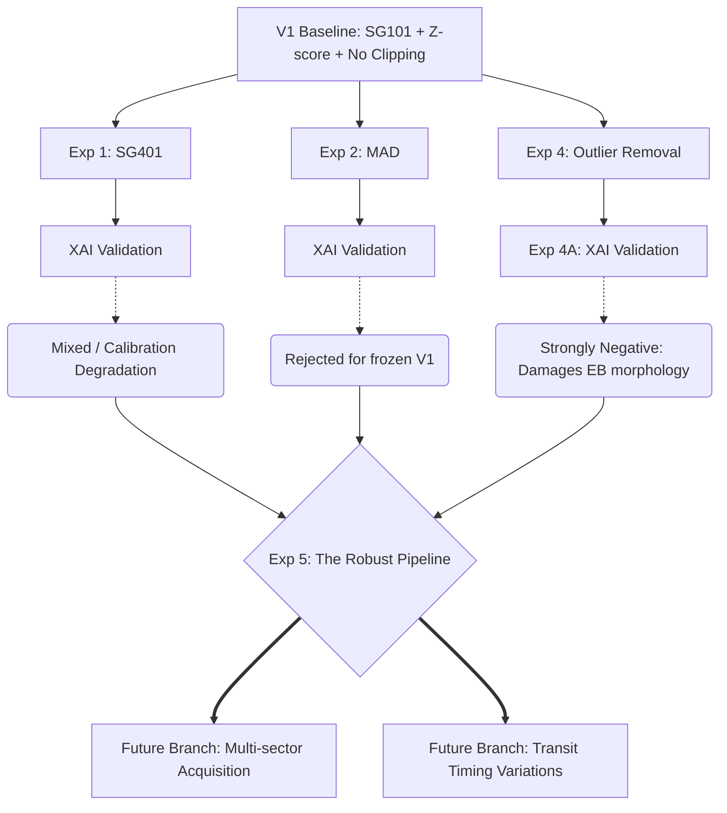

# Exoplanet Detection Pipeline: Astronomical Research Roadmap

This document outlines the strategic upgrade paths required to elevate the current Exoplanet Detection pipeline from a "Tier 1 Triage Engine" to a publication-grade, fully robust astronomical tool.

The core philosophy of this roadmap is **methodological discipline**: One variable at a time. Rather than accumulating models in a naive pursuit of 95% accuracy, this project systematically tests preprocessing operations, rigorously validates them via Explainable AI (XAI), and learns to reject hypotheses that destroy physical signal.

## The V2 Experimental Tree

The development of the robust pipeline is structured as a modular experimental matrix. Each experiment freezes the architecture and isolates a single preprocessing variable. 

### Current Experimental Matrix Status

| Experiment | Configuration | Result | Status |
|---|---|---|---|
| **V1** | Z-score + SG101 + no clipping | Baseline | ✅ Active |
| **Exp 1** | SG401 | Mixed / calibration degradation | ❌ Rejected |
| **Exp 2** | MAD | Rejected for frozen V1 | ❌ Rejected |
| **Exp 3** | Multi-sector | Methodological failure | ⏸️ Future work |
| **Exp 4** | Outlier removal | Strongly negative | ❌ Rejected |

*Note: Learning to say "no" to hypothesized improvements (MAD, SG401, raw outlier removal) is the primary engine of scientific rigor in this project.*

---

## Future Branches (Post-Exp 5)

Once the V2 matrix is completed and synthesized into **Exp 5 (The Robust Pipeline)**, the project will unfreeze the architecture and branch into macroscopic astronomical challenges.

### Future Branch A: The Multi-Sector Blind Spot
**The Vulnerability:** The current pipeline only downloads the first available TESS observation sector (27 days), rendering the pipeline completely blind to any planet in a habitable zone (e.g., Earth takes 365 days).
**The Upgrade:**
1. Use `search_result.download_all()` and `lightkurve.stitch()` to seamlessly merge years of data.
2. Make the BLS algorithm **dynamic** (searching up to half the length of the stitched baseline).
*Note: Early naive testing of this (Exp 3) proved that multi-sector data introduces severe selection bias if dataset construction is not rigorously controlled.*

### Future Branch B: Multi-Year Data Gaps & The AI VETO Engine
**The Vulnerability:** Stitching TESS data separated by months creates massive empty gaps that trick Box-Least Squares (BLS) into outputting mathematically perfect, but physically false, artifact periods.
**The Upgrade:** Rely on the CNN as a Triage Engine to inspect the phase-folded signal, recognize that the physical morphology is a gap-induced mathematical anomaly rather than a U-shaped transit, and successfully **VETO** the signal.

### Future Branch C: Transit Timing Variations (TTVs)
**The Vulnerability:** Phase-folding fundamentally assumes that the planet's orbit is a perfect, unchanging clock. In multi-planet systems, gravitational tugs cause planets to transit a few minutes early or late (TTVs). A strict phase-fold will smear these offset transits into undetectable noise.
**The Upgrade:**
1. Implement a **Global + Local** neural network architecture.
2. Pass the raw, unfolded time-series through a 1D ResNet or Self-Attention mechanism (Transformer) to spot individual transit events that do not align perfectly with a periodic clock.
