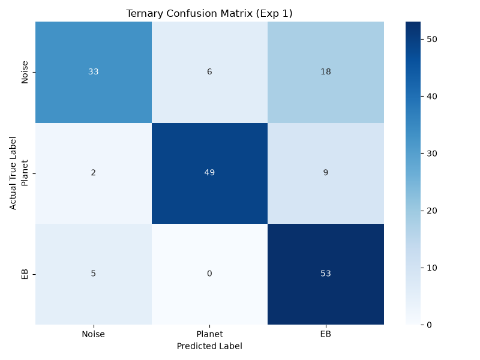

# V2_EXP1_001

## Configuration
* **Model**: `exoplanet_cnn_v1.keras` (Frozen V1 Reference)
* **Dataset**: `tess_dataset_exp1.npz` (Test Split: 20%, Seed 42, Stratified)
* **Preprocessing Contract**: TERNARY_V1
  * Sectors: 1
  * Outlier Removal: OFF
  * SG Window: 401
  * Scaling: Z-Score (Mean/Std)
  * Clipping: OFF

## Global Metrics
* **ROC-AUC (OVR)**: 0.9205
* **Expected Calibration Error (ECE)**: 0.1237
* **Brier Score**: 0.1206
* **Mean MC Dropout Epistemic Uncertainty**: 0.0666

## Per-Class Performance
| Class | Precision | Recall | F1-Score | Support |
| :--- | :---: | :---: | :---: | :---: |
| **0 (Noise)** | 0.8250 | 0.5789 | 0.6804 | 57.0 |
| **1 (Planet)** | 0.8909 | 0.8167 | 0.8522 | 60.0 |
| **2 (EB)** | 0.6625 | 0.9138 | 0.7681 | 58.0 |
| **Accuracy** | - | - | **0.7714** | 175.0 |

## Artifacts

*(Note: Advanced dynamic metrics like SNR and Transit Depth will be mapped incrementally in future experimental scripts. This establishes the numerical floor for Exps 1-5).*
